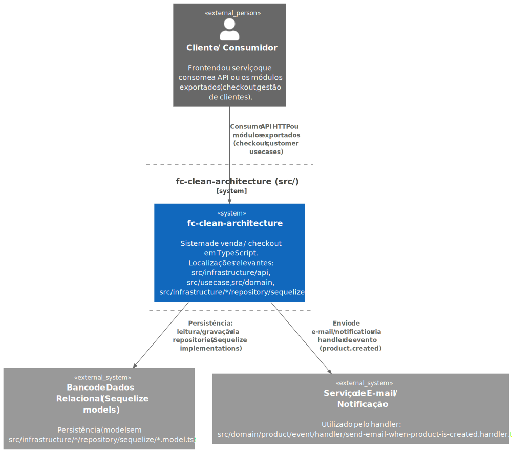
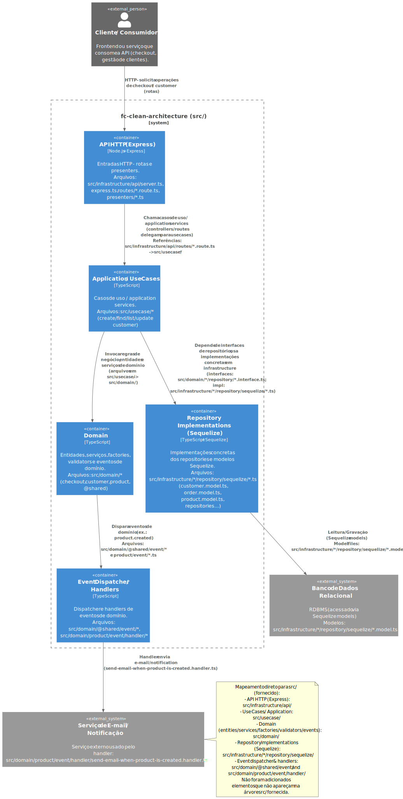
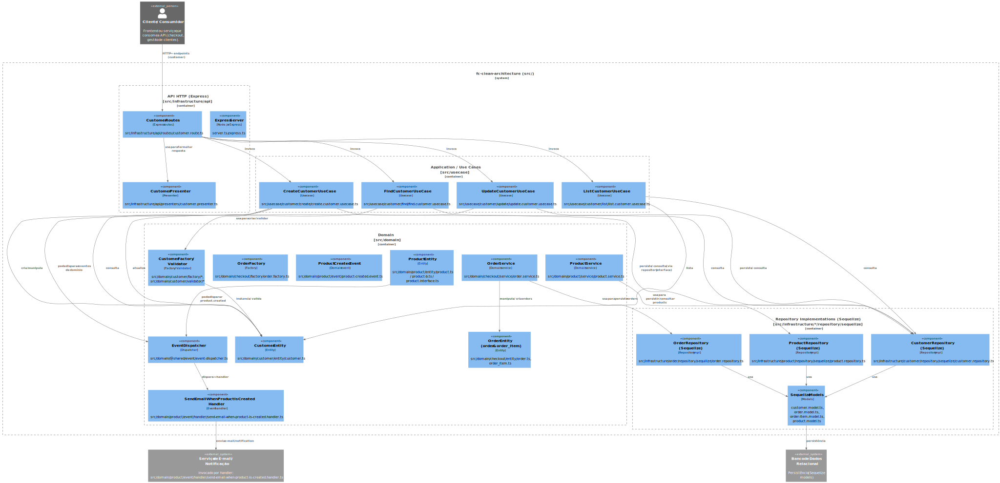
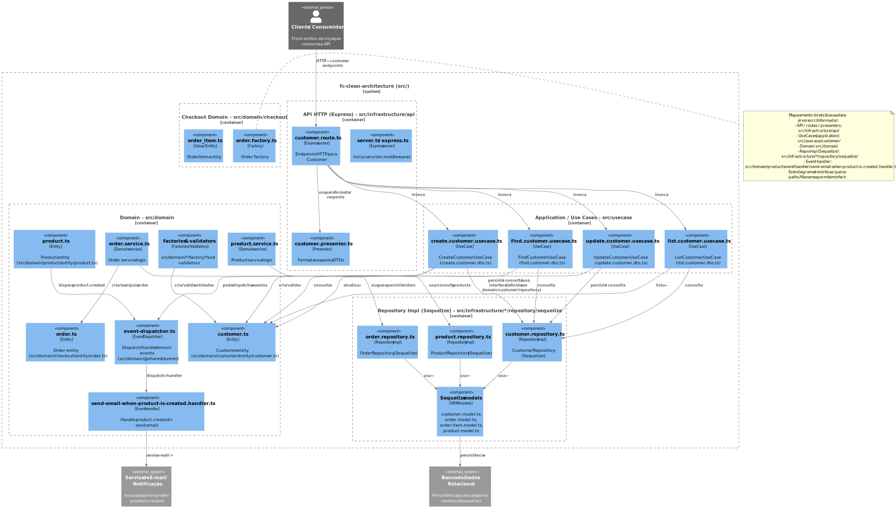

[](https://github.com/danielso2007/fc-clean-architecture/pulls)
[](https://github.com/danielso2007/fc-clean-architecture/issues?q=is%3Aopen+is%3Aissue)


[](https://conventionalcommits.org)

# Projeto Clean Architecture

Para estudo.

# Estrutura do projeto

Obs.: Para gerar essa saída, foi usado o comando: `tree -I "node_modules|dist|.git"`.

```
.
├── CHANGELOG.md
├── eslint.config.mjs
├── jest.config.ts
├── package.json
├── package-lock.json
├── README.md
├── src
│   ├── domain
│   │   ├── checkout
│   │   │   ├── entity
│   │   │   │   ├── order_item.ts
│   │   │   │   ├── order.spec.ts
│   │   │   │   └── order.ts
│   │   │   ├── factory
│   │   │   │   ├── order.factory.spec.ts
│   │   │   │   └── order.factory.ts
│   │   │   ├── repository
│   │   │   │   └── order-repository.interface.ts
│   │   │   └── service
│   │   │       ├── order.service.spec.ts
│   │   │       └── order.service.ts
│   │   ├── customer
│   │   │   ├── entity
│   │   │   │   ├── customer.spec.ts
│   │   │   │   └── customer.ts
│   │   │   ├── factory
│   │   │   │   ├── customer.factory.spec.ts
│   │   │   │   ├── customer.factory.ts
│   │   │   │   └── customer.validator.factory.ts
│   │   │   ├── repository
│   │   │   │   └── customer-repository.interface.ts
│   │   │   ├── validator
│   │   │   │   └── customer.yup.validator.ts
│   │   │   └── value-object
│   │   │       └── address.ts
│   │   ├── product
│   │   │   ├── entity
│   │   │   │   ├── product-b.ts
│   │   │   │   ├── product.interface.ts
│   │   │   │   ├── product.spec.ts
│   │   │   │   └── product.ts
│   │   │   ├── event
│   │   │   │   ├── handler
│   │   │   │   │   └── send-email-when-product-is-created.handler.ts
│   │   │   │   └── product-created.event.ts
│   │   │   ├── factory
│   │   │   │   ├── product.factory.spec.ts
│   │   │   │   └── product.factory.ts
│   │   │   ├── repository
│   │   │   │   └── product-repository.interface.ts
│   │   │   └── service
│   │   │       ├── product.service.spec.ts
│   │   │       └── product.service.ts
│   │   └── @shared
│   │       ├── entity
│   │       │   └── entity.abstract.ts
│   │       ├── event
│   │       │   ├── event-dispatcher.interface.ts
│   │       │   ├── event-dispatcher.spec.ts
│   │       │   ├── event-dispatcher.ts
│   │       │   ├── event-handler.interface.ts
│   │       │   └── event.interface.ts
│   │       ├── notification
│   │       │   ├── notification.error.ts
│   │       │   ├── notification.spec.ts
│   │       │   └── notification.ts
│   │       ├── repository
│   │       │   └── repository-interface.ts
│   │       └── validator
│   │           └── validator.interface.ts
│   ├── infrastructure
│   │   ├── api
│   │   │   ├── express.ts
│   │   │   ├── presenters
│   │   │   │   └── customer.presenter.ts
│   │   │   ├── routes
│   │   │   │   └── customer.route.ts
│   │   │   ├── server.ts
│   │   │   └── __tests__
│   │   │       └── customer.e2e.spec.ts
│   │   ├── customer
│   │   │   └── repository
│   │   │       └── sequelize
│   │   │           ├── customer.model.ts
│   │   │           ├── customer.repository.spec.ts
│   │   │           └── customer.repository.ts
│   │   ├── order
│   │   │   └── repository
│   │   │       └── sequilize
│   │   │           ├── order-item.model.ts
│   │   │           ├── order.model.ts
│   │   │           ├── order.repository.spec.ts
│   │   │           └── order.repository.ts
│   │   └── product
│   │       └── repository
│   │           └── sequelize
│   │               ├── product.model.ts
│   │               ├── product.repository.spec.ts
│   │               └── product.repository.ts
│   └── usecase
│       └── customer
│           ├── create
│           │   ├── create.customer.dto.ts
│           │   ├── create.customer.unit.spec.ts
│           │   └── create.customer.usecase.ts
│           ├── find
│           │   ├── find.customer.dto.ts
│           │   ├── find.customer.integration.spec.ts
│           │   ├── find.customer.unit.spec.ts
│           │   └── find.customer.usecase.ts
│           ├── list
│           │   ├── list.customer.dto.ts
│           │   ├── list.customer.unit.spec.ts
│           │   └── list.customer.usecase.ts
│           └── update
│               ├── update.customer.dto.ts
│               ├── update.customer.unit.spec.ts
│               └── update.customer.usecase.ts
├── tsconfig.json
├── tsconfig.tsbuildinfo
└── tslint.json
```

# Diagrama C4 Model

### Nível 1



### Nível 2



### Nível 3



### Nível 4


